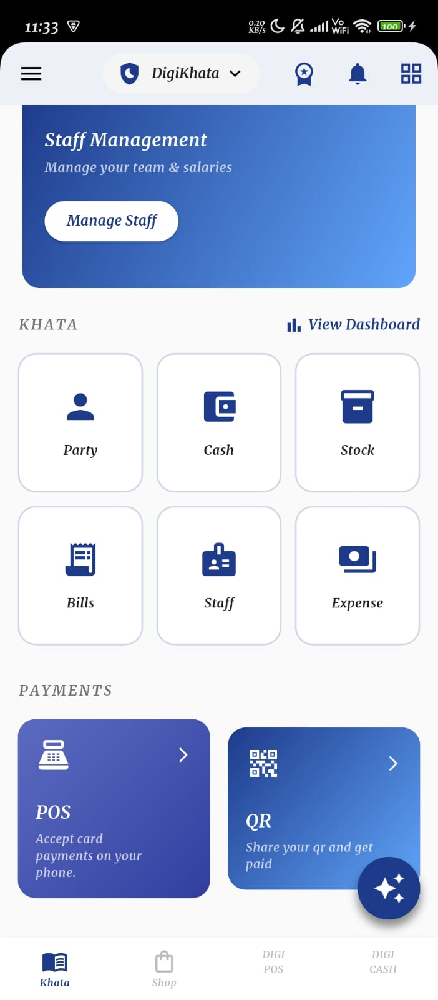
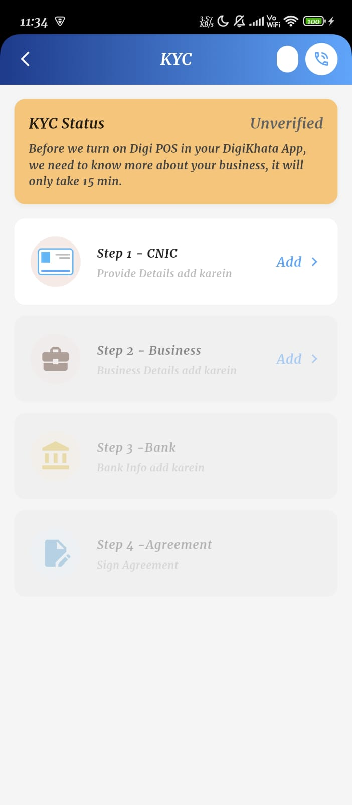
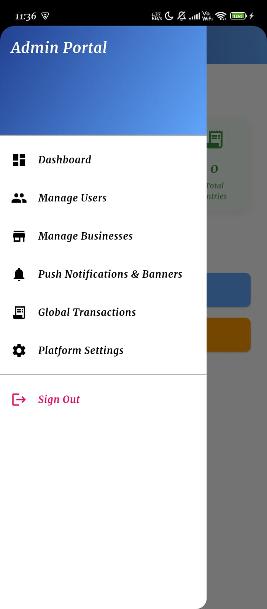
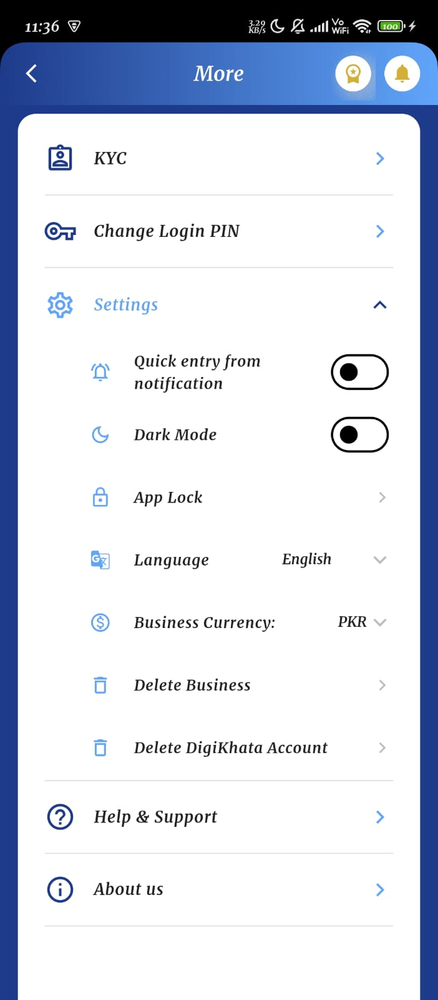

# Zenvyro Labs - DigiKhata Clone Ecosystem

A production-ready multi-platform Flutter application serving two distinct environments from a single codebase:
1. **The Mobile Ledger App (Customer Side)**: For shopkeepers to manage their ledgers, customers (parties), and cash book locally (offline-first) and synced to the cloud.
2. **The Super Admin Panel (Web Side)**: A web-based dashboard for Zenvyro Labs management to monitor businesses, users, and ecosystem health.

## Application Screenshots showcase

| Core Dashboard | DigiCash Wallet | DigiPOS & KYC |
| :---: | :---: | :---: |
|  |  |  |

| AI Assistant Beta | Web Super Admin | Settings |
| :---: | :---: | :---: |
|  |  |  |

| Multi Devices | Recycle Bin | 
| :---: | :---: | 
|  |  | 

## Technologies Used
*   **Flutter** (Multi-platform UI Framework)
*   **Supabase** (PostgreSQL Database & Authentication)
*   **GoRouter** (Advanced Routing & Deep Linking)
*   **Riverpod** (Modern State Management)
*   **Isar Database** (High-Performance Offline Local Database)

## Setup & Running Guide
We have created dedicated workflow scripts located in `.agent/workflows/` that you can run to effortlessly configure and launch your app. 

### 1. Database & Authentication Setup
Please refer to [setup.md](.agent/workflows/setup.md) for how to configure a Dummy Phone number inside Supabase to test OTPs without paying for SMS services.

### 2. How to Launch
Please refer to [running_app.md](.agent/workflows/running_app.md) for precise commands on how to launch the Mobile App vs the Web Admin Panel.
*   **To run Mobile App (Ledger):** `flutter run -d android`
*   **To run Web App (Admin Panel):** `flutter run -d chrome`

## Project Architecture
The project strictly follows a **Feature-First Architecture** grouped under `lib/features/`:
*   `/auth`: Supabase OTP Authentication Flow and Splash Screen.
*   `/ledger`: Cash Books, Ledger Entries, and Business Management logic.
*   `/customers`: Party models and Customer Ledger calculations.
*   `/admin`: Super Admin dashboards natively disabled on mobile.
*   `/core/database`: `local_db.dart` (Isar offline sync rules) & `supabase_client.dart` (Global Cloud instance).

---
*Developed for Zenvyro Labs*